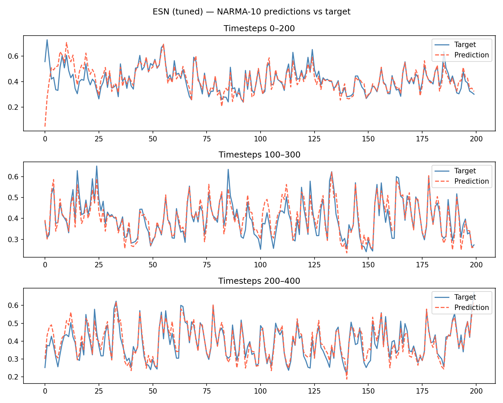
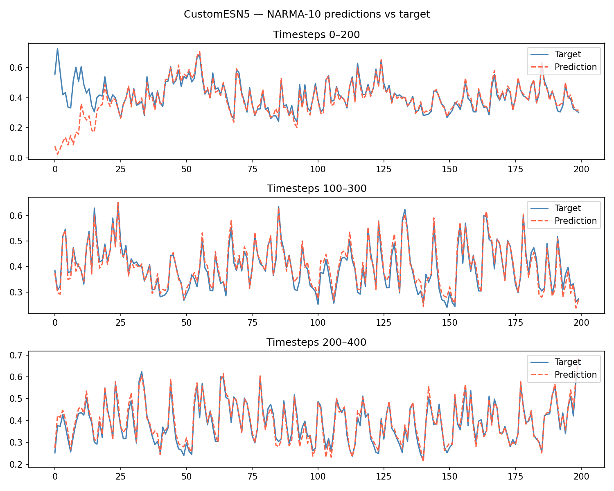
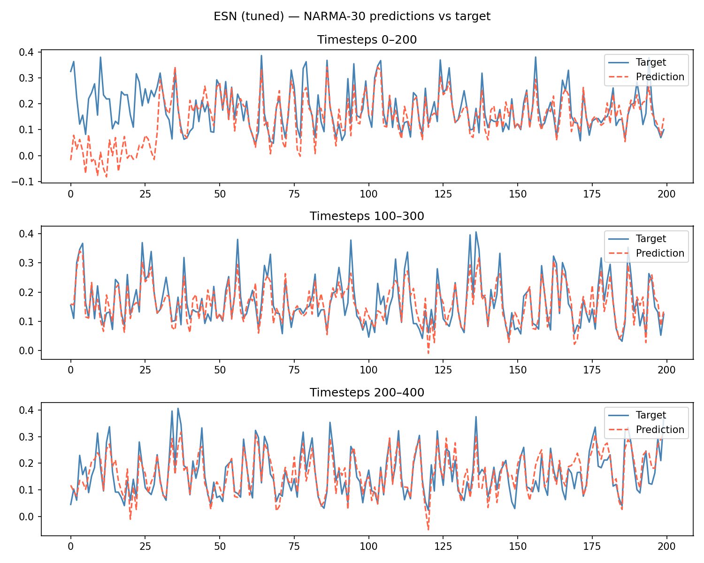
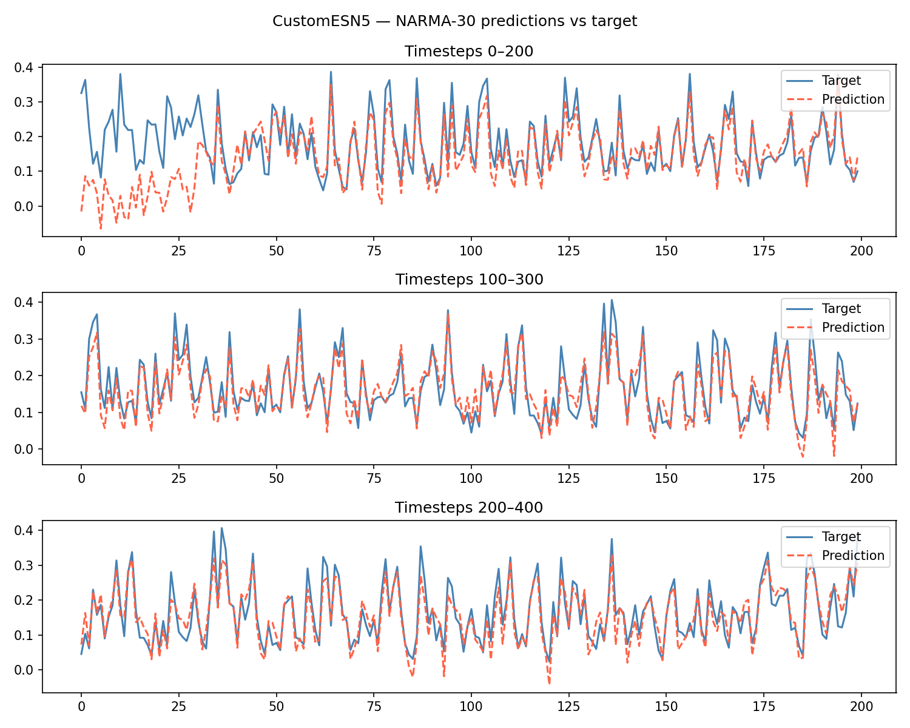

# Echo State Network z kontrolowanym rozkładem wartości własnych

## 1. Wprowadzenie

Postanowiłem opracować inną metodę niż tą eksplorowaną wcześniej - zamiast proponować całkowicie nową architekturę, skupiłem się na modyfikacji standardowego ESN w taki sposób, aby umożliwić bezpośrednią kontrolę nad rozkładem wartości własnych macierzy rezerwuaru. Jest to bezpieczniejsze podejście ze względu na to, że zachowuje podstawową strukturę ESN, która jest dobrze zrozumiana i szeroko stosowana, a jednocześnie pozwala na eksperymentowanie z nowymi właściwościami rezerwuaru poprzez manipulację jego spektralnymi właściwościami.

Celem pracy jest zbadanie alternatywnych metod konstrukcji i optymalizacji sieci Echo State Network (ESN). Standardowe podejście do inicjalizacji macierzy rezerwuaru opiera się na losowym generowaniu wag z późniejszym skalowaniem promienia spektralnego. W niniejszej pracy proponujemy metodę, która umożliwia bezpośrednią kontrolę rozkładu wartości własnych macierzy rezerwuaru przy jednoczesnym zachowaniu zadanego wzorca rzadkości.

---

## 2. Przegląd ESN

Echo State Network to rekurencyjna sieć neuronowa, w której wagi wewnętrzne rezerwuaru oraz wagi wejściowe są losowo inicjalizowane i pozostają niezmienione podczas uczenia. Uczeniu podlegają wyłącznie wagi wyjściowe $W_{out}$, wyznaczane metodą ridge regression.

Dynamika rezerwuaru opisana jest równaniem:

$$x(t) = (1 - \alpha) x(t-1) + \alpha \tanh(W_{in} u(t) + W x(t-1))$$

$\alpha$ - leaky rate
$u(t)$ — wejście
$W_{in}$ — macierz wag wejściowych
$W$ — macierz rezerwuaru

Wagi wyjściowe wyznaczane są jako:

$$W_{out} = (X^T X + \lambda I)^{-1} X^T Y$$

Ostateczna predykcja:
$$\hat{y}(t) = W_{out} \begin{bmatrix} u(t) \\ x(t) \end{bmatrix}$$

Kluczową własnością ESN jest echo state property — stan sieci musi zapominać swój stan początkowy, co tradycyjnie zapewnia się przez ograniczenie promienia spektralnego $\rho(W) < 1$.

---

## 3. Przegląd zadań

Eksperymenty przeprowadziłem na czterech standardowych benchmarkach dla sieci rekurencyjnych. Wybrałem te zadania ze względu na to, że są one tradycyjnie używane do oceny ESN. W zadaniach tego typu modele ESN osiągają lepsze wyniki niż bardziej złożone architektury RNN, np. LSTM. 

### NARMA-10 i NARMA-30

Zadania NARMA (Nonlinear AutoRegressive Moving Average) polegają na aproksymacji nieliniowego systemu dynamicznego rzędu $n$:

$$y(t+1) = 0.3\, y(t) + 0.05\, y(t) \sum_{i=0}^{n-1} y(t-i) + 1.5\, u(t-n+1)\, u(t) + 0.1$$

gdzie $u(t) \sim \mathcal{U}(0, 0.5)$ jest niezależnym sygnałem wejściowym.

NARMA-10 i NARMA-30 wybrano ze względu na to, że bezpośrednio mierzą zdolność rezerwuaru do przechowywania historii wejścia (memory capacity) oraz przetwarzania nieliniowego — obie cechy zależą bezpośrednio od struktury macierzy $W$.

### Mackey-Glass i Lorenz

Zadania predykcji autonomicznej na układach chaotycznych. Nie ma tutaj zewnętrznego wejścia, jak w zadaniach NARMA. 
Model po fazie rozgrzewania generuje trajektorię bez dostępu do rzeczywistych wartości — każde jego wyjście staje się kolejnym wejściem. Stanowią znacznie trudniejszy benchmark, szczególnie Lorenz. Wymagają stabilnej dynamiki rezerwuaru, która nie degeneruje do stałej ani nie eksploduje. Są więc dobrym testem dla proponowanej metody kontroli rozkładu wartości własnych.

---

## 4. Proponowane podejście — Isospectral ESN

Standardowy ESN nie daje kontroli nad rozkładem wartości własnych $W$ — skalowanie promienia spektralnego ustala jedynie największą wartość własną, nie kształt całego rozkładu. Zaproponowana metoda umożliwia generowanie rzadkiej macierzy $W$ z dowolnie zadanym zestawem wartości własnych. Wiele prac w zakresie ESN sugeruje, że kształt rozkładu wartości własnych ma istotny wpływ na zdolność modelu do przechowywania informacji i przetwarzania nieliniowego. Przykładowo sieci Edge of Stability (EoS) sugerują, że wartości własne bliskie jednostki mogą zapewnić długą pamięć, ale zbyt bliskie mogą prowadzić do niestabilności. Ideą jest więc optymalizacja rozkładu wartości własnych, a nie tylko jego promienia, w celu lepszego dopasowania właściwości rezerwuaru do specyfiki zadania. 

Procedura wygląda następująco:
1. Wybieramy rozkład wartości własnych (w tym przypadku zespół Ginibrego) z paremetrami do optymalizacji.
2. Generujemy rzadką macierz o zadanym rozkładzie wartości własnych i narzuconym, losowym wzorcu rzadkości (w celu zachowania podobnych właściwości do standardowego ESN).
3. Używamy tej macierzy jako rezerwuaru w ESN i optymalizujemy hiperparametry (leaky rate, input scaling, ridge) włącznie z parametrami rozkładu wartości własnych z wykorzystaniem Optuna.

### Rozkład wartości własnych — zespół Ginibrego

Wartości własne próbkowane są z zespołu Ginibrego z wagą skupiającą je w pierścieniu $[r_{min}, r_{max}]$ z parametrem kształtu $\alpha$:

$$p(r) \propto r \cdot \exp\!\left(-\alpha \left(\frac{r - r_{min}}{r_{max} - r_{min}}\right)^2\right)$$

Parametry $r_{min}$, $r_{max}$, $\alpha$ są optymalizowane przez Optuna.

### Generowanie rzadkiej macierzy z zadanym rozkładem wartości własnych

Metoda opiera się na iteracyjnej projekcji przemiennej z dekompozycją Schura:

1. **Faza wstępna** (jednorazowa, bez użycia docelowych wartości własnych): przez 100 iteracji Schura wyznaczany jest szablon $(T_{template}, Z_{template})$ dostosowany do wzorca rzadkości.
2. **Faza generowania**: wartości własne z szablonu zastępowane są docelowymi (optymalne przypisanie algorytmem Węgierskim), następnie wykonywanych jest $n_{refine}=30$ iteracji doprecyzowujących:

$$W \leftarrow (Z \cdot T_{new} \cdot Z^H) \odot M$$

gdzie $M$ to binarna maska rzadkości, a $\odot$ to zerowanie elementów poza maską.

Kluczową własnością tej metody jest to, że rzadkość jest gwarantowana przez twarde zerowanie, a wartości własne są przybliżane iteracyjnie z rosnącą dokładnością.

---

## 5. Wstępne wyniki

Poniżej przedstawiono wyniki dla zadań NARMA-10 i NARMA-30. Oba modele używają rezerwuaru rozmiaru $N=200$ i są optymalizowane przez 100 prób algorytmem Optuna. Jako metrykę stosujemy NMSE (Normalized Mean Squared Error).

### NARMA-10

| Model | Val NMSE | Test NMSE |
|---|---|---|
| ESN  | 0.1283 | 0.1419 |
| Isospectral ESN | **0.0958** | **0.1273** |

*Rysunek 1. Predykcje ESN na zbiorze testowym, NARMA-10.*

*Rysunek 2. Predykcje Isospectral ESN na zbiorze testowym, NARMA-10.*

### NARMA-30

| Model | Val NMSE | Test NMSE |
|---|---|---|
| ESN | 0.3171 | 0.3538 |
| Isospectral ESN | **0.2376** | **0.2605** |

*Rysunek 3. Predykcje ESN na zbiorze testowym, NARMA-30.*

*Rysunek 4. Predykcje Isospectral ESN na zbiorze testowym, NARMA-30.*

### Komentarz

Isospectral ESN uzyskuje lepsze wyniki niż standardowy ESN na obu zadaniach NARMA — o ok. 10 p.p. na NARMA-10 i ok. 26 p.p. na NARMA-30. Sugeruje to, że kontrolowany rozkład wartości własnych pozwala lepiej dopasować właściwości pamięci rezerwuaru do specyfiki zadania.

Zadania predykcji autonomicznej (Mackey-Glass, Lorenz) są obecnie w trakcie opracowywania. Wymagają dodatkowych technik takich jak injekcja szumu podczas uczenia oraz modyfikacja funkcji celu w celu zapobiegania degeneracji predykcji do wartości stałej. W tej chwili żadne z implementacji nie są w stanie uzyskać stabilnej predykcji na tych zadaniach, ale prace trwają. W oryginalnych pracach na temat ESN, stabilna predykcja była osiągalna. 

## 6. Dalsze prace
- Opracowanie stabilnej inferencji na zadaniach predykcji autonomicznej (Mackey-Glass, Lorenz).
- Inne rozkłady prawdopodobieństwa wartości własnych (np. skupienie w pobliżu jednostki, rozkład potęgowy).
- Inne metody generowania macerzy o danym rozkładzie wartości własnych (np. optymalizacja gradientowa, metody oparte na grafach).